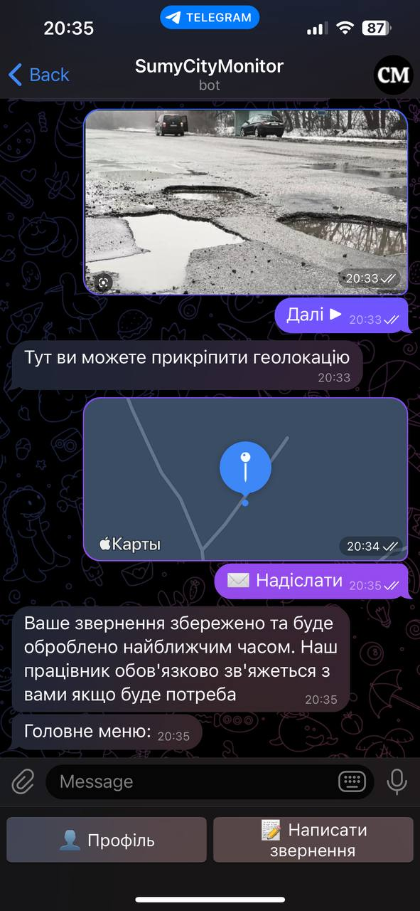

# CityMonitor Project

Information system that allows government keep in touch with locals, gather needed information by using quizzes which provides ability to make right decision timely. Also, locals have opportunity to send requests/reports with some wishes, problems. The main feature of this system is ability to make quizzes on specified areas and get results considering this dividing.

There are two modules in system:
* Telegram bot - interface for locals
* Web-application - admin panel

## Technology stack
Java 18, Spring Boot 2.7 (JPA, Security, Web, Validation, Thymeleaf), Hibernate Spatial 5.6.12, PostgreSQL 15 with Postgis extension, Telegram API 5.7.1, Google Maps API, JavaScript, jQuery, HTML, Bootstrap

## How to deploy with docker

Firstly you need to fulfill environment properties in variables.env file.
Then go to the project root folder and execute such command:

```
docker-compose -f docker-compose.yml --env-file ./variables.env  up -d
```

Default credentials: sysadm/sysadm

## Screenshots

#### Chatbot





#### Admin panel


